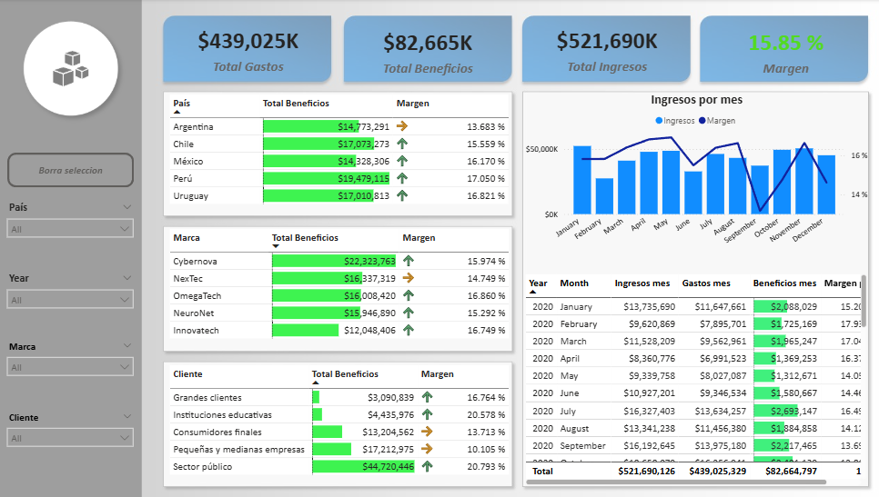

# Portafolio de María Fernanda Gutiérrez

Este portafolio pretende mostrar algunos proyectos prácticos de analisis financiero que he realizado en power bi.

## Explicación del análisis

De una empresa de tecnología se obtuvo información de sus ingresos y gastos entre los años 2020 y 2022. 
Se calcularón beneficios y margen para obtener un análisis más completo. El reporte muestra la información de los países, marcas y clientes desglosada por años.

