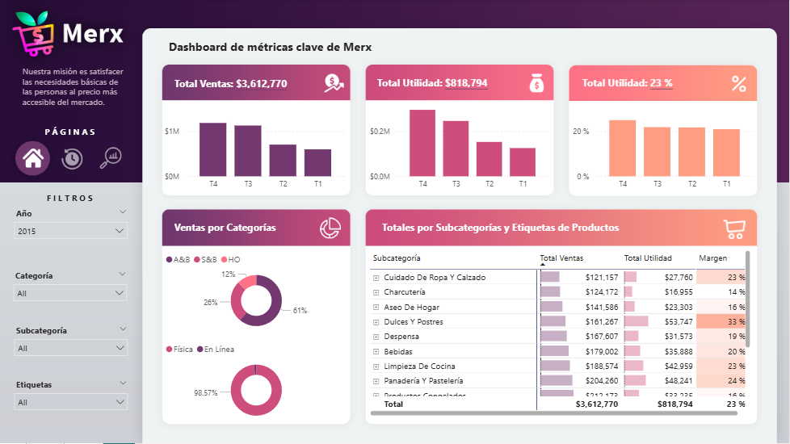
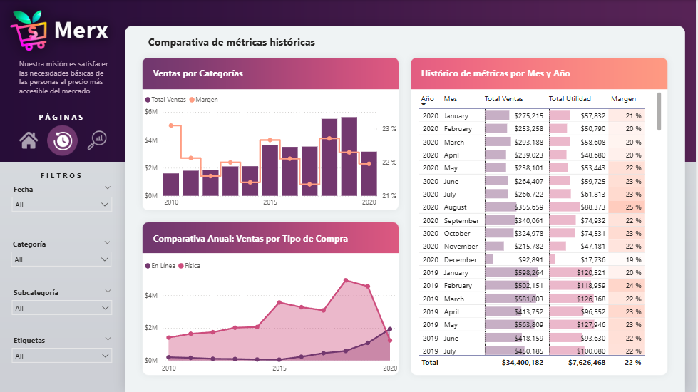
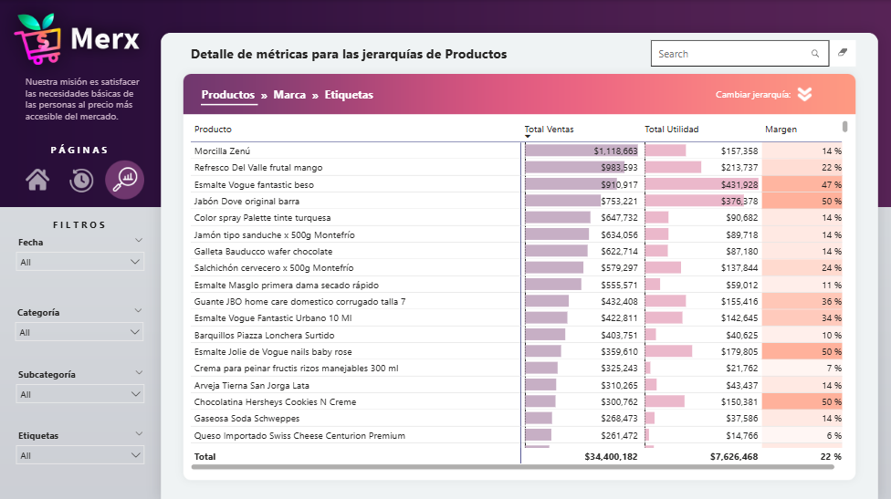

## 💻 Proyecto Merx Reporte Ventas

# Se hizo un análisis de las ventas y compras realizadas en la empresa Merx, através de un modelo estrella se identificaron las dimensiones de nuestra data principal para poder estructurar correctamente toda la información proporcionada. 
# El reporte se encuentra dividivo en tres tableros, el principal contiene las visualizaciones gráficas de las métricas clave, el segundo una comparativa de las métricas históricas y el tercero  el detalle para las jerarquías de productos. 

