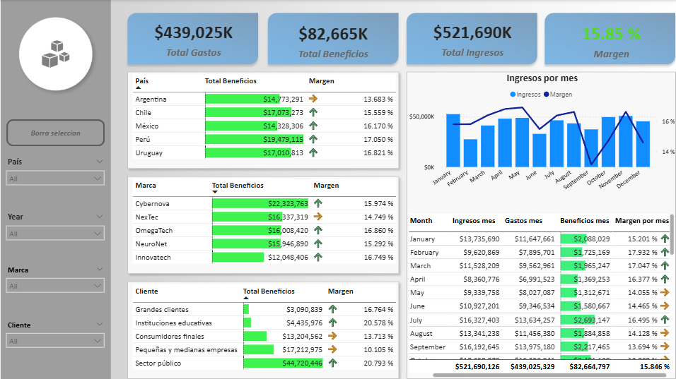

# 💻 Proyecto TecnoEmpresa Reporte Financiero 

## Se anlizaron los ingresos y gastos registrados en la empresa durante tres años, vizualizando la información desglosada por país, marca y cliente. Realicé medidas para obtener datos adicionales como beneficios y margen con la finalidad de completar nuestra información.

